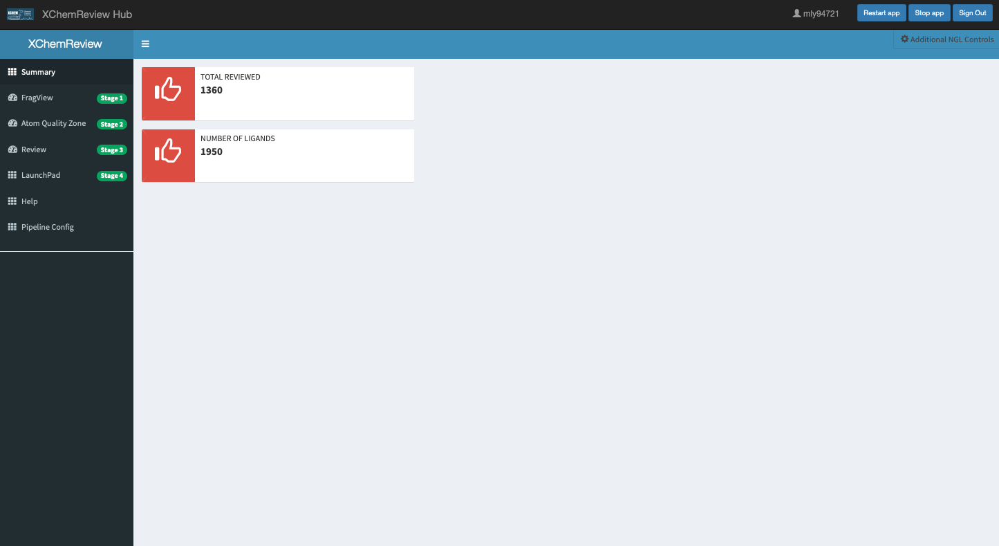

# XChemReview Visual Guide

## Table of Contents

1. [About](#about)
2. [General Layout](#general-layout)
3. [Annotation](#annotation)
4. [Atom Quality](#atom-quality)
5. [Review](#review)
6. [Upload to Fragalysis](#upload-to-fragalysis)
7. [Pipeline Configuration](#pipeline-configuration)

## About

XChemReview (XCR) is a web application to annotate and review fragment screening data in a rapid and convenient manner. Data in XCR is tied to your soakdb files which can be modified using XCE. Specifically, all data that is marked as Comp Chem Ready, Deposition Ready and Deposited will appear in XCR and will be visible until they are moved from that state (e.g. back to Refinment or Rejected).

## General Layout

Upon successfully connecting to XCR you will be presented with the following screen. In the main body you will see a summary of the number of ligands you have in total to manually review and the number you have completed thus far. If you have multiple campaigns this number may be quite large but review and annotating data does not take that much time compared to refinement.

The tabs on the side are enumerated by the in which you should approach preparing your data for upload to fragalysis. In the top-right corner there is a button called 'Additional NGL Controls' which will bring up a control-panel like pop-up that will let you change some global options relating to how you can control the NGL viewer which lets you see your data. By default (for pressing ceremonial reasons) the NGL viewer uses coot mouse bindings for moving around the screen. If you prefer PyMol or the native NGL viewer controls you can change them in this window.

## Annotation

Fragment annotation is completed in the FragView tab. When you first visit this tab you will need to select a protein to visualise which is done in the "Protein Select" dropdown menu. This should be populated with targets that you are authorised to see. Upon selecting a protein, the table and the black window will populate with a list of ligands and the protein model and transparent ligands respectively. This is the overally view of your protein and ligands in 3D space. And is a nice overview to visualise where majority of the ligands bind and could inform the context of the site labels.

Clicking on a row in the table OR selecting a ligand in the "Go to Ligand" dropdown menu will render the ligand in a green colour. This will fill some information in sidebar on the left hand side which means it is ready for annotation.

When annotating a ligand we have the ability to modify some descriptive qualities of the ligand. Such as the site label, it's name as it would appear in fragalysis and even how the ligand may appear downstream if there are slight technical problems associated with the SMILES string.

The only required field for an annotation is the Site Label. Which is a dropdown list from already populated Sites OR a free form text input to place your own site label. Simply type in the field and it will create a new site label. Every other annotation field is free text.

Once you have finished annotating a ligand, press the "Write metadata to table" button to save the annotation and move onto the next ligand. Simply click on another row in the table OR click the "Prev Ligand" or "Next Ligand" to load the next data.

IF you have a ligand you do not wish to annotate or expressly do not want to upload to Fragalysis, please enter `IGNORE` into the Site Label.

## Atom Quality

**N.B. If the options beneath the white line in the sidebar or the black box does not appear switch between the Atom Quality Zone tab and the Summary Tab until it behaves correctly (it's a weird bug and that fixes that issue.)**

After you have annotated your ligand, you should go through the data and appreciate the ligands in terms of atom quality. This is your opportunity to select individual atoms in both the ligand and the protein and give an honest crique about some issues and doubts you have about the experiment.

This is to encourage ligands that have weak evidence that suggests binding due to an uncharacterised features or multiple conformations (for example). We are simply providing the mechanisms to be forthcoming with marginal data.

Much in the same way you can do the reviews. Select the Protein you wish to view and select a ligand from the table or dropdown menu. This will load the data into the black box, the ligand will appear in a lime green colour.

To annotate a ligand simply select atoms using alt + left click over the atom you wish to select, and the atom will appear in the table on the left. Select as many atom as you would like to critique. To add context to these atoms, you can add a comment in the dropdown menu/text input field and then either click the write to all atoms or write to selected rows (after clicking on the particular rows you would like to change) buttons. After the table has been populated you are free to press the "submit atom qualities" button to save your critique.

You additionally are able to render b factors and possibly see the buster report to aid in your critique of atoms but this might not be available to all ligands.

You only have to submit atom reviews for ligands you think are questionable or have problems you would like to acknowledge as the all bad atoms will be rendered in a particular way to inform people who look at the data at a later date. These people may not be experts or familiar with the protein so this is your opportunity to guide other scientists away from elaborating on a ligand in areas that have little to no evidence to suggest it is worthwhile to explore.

## Review

Ideally this should be done by someone who did not refine the data. But if you are working as a lone scientist you have my permission to review your own work!

Select the target you wish to review for in the "Select Protein" drop down menu. Underneath the Submit button you make have to enable the checkboxes to display all the ligands. As it only shows comp chem ready ligands by default.

To review a ligand, select it by clicking on the row in the table on the lower right hand side. This will load the ligand up. You will be able to configure how you wish to visualise to data, toggling on and off electron density maps and highlighting specific residues that could be a useful reference point. Any atoms that were labelled in the previous step will be rendered differently so you can examine what will be seen in fragalysis.

To submit a review, simply complete the form on the left hand side of the page and click submit. This will then be reflected in the table to the right. When performing a review this will give you an opportunity to critique the refinement and pass information back to the refiner about issues you have with the model in the free-form Additional comments section. For example a residue could be slightly in the wrong position or there are water molecules missing from the model. This is the place to make these comments!

In the panel on the bottom left you are also able to change the assmembly or visualise the raw data to ensure that the data is correct. In the Ligand Information tab in the box you may be able to see an interation plot, the buster report and even render the bfactors.

## Upload to Fragalysis

Congratulations, you have probably just annotated and reviews 100+ ligands. You are almost there, You just have to upload the data to fragalysis. Thankfully this step is the easiest and least contrived.

Select your protein you wish to upload using the "Select Target" drop down menu. Review the table, to make sure all the site labels make sense to you. And that all ligands you wish to upload are present. **Remember that XCR will only upload ligands that have an annotation (that is not `IGNORE`) and have been marked as `Release` in the review panel!** Once you are satisfied with the manifest, simply fill in the remaining boxes.

If you want your data to be publicly facing, simply enter `OPEN` in the box that says Proposal. Otherwise you need to input your proposal number from your visit at Diamond. For example if my proposal was `lb12345` I would have to put `12345` into the box.

After the form is filled, click the "Upload Data" button and have a brew. You have just published your fragment screen to the internet. You can now write that tweetorial!

## Pipeline Configuration

Lastly, this tab contains to opportunity to control how the internally pipelines running at diamond will process your data for visualisation in XCR and Fragalysis. We have to make some assumptions about how the data is processed, so if it is not correct you are able to make some changes.

Typically you will only need to change 2 options.

The first being whether or not PISA/gemmi convert is run on your data to identify the first biological assembly. This can have consequences on the data, so sometimes it is useful to not run PISA/Gemmi convert on the data.

The second option you may want to change is how the alignment algorithm treats your data. Specifically, if your protein contains multiple chains, how those chains shall be used. By default we assume that additional changes can align approximately well with the first Chain however we are aware that this is often not the case. Therefore, we give you the option to turn it off.

Once you have picked your desired options, click the submit button and then refresh the data on diamonds disk. You might have to do this using a command while connected to diamond via NX or ssh.

You can do this using the following command:

`find /dls/labxchem/data/{proposal/year}/{visit}/processing/analysis/model_building/ -type f -name "*.pdb" -exec touch {} +`

For example if my data is located in lb12345/lb12345-1 I would use:

`find /dls/labxchem/data/lb12345/lb12345-1/processing/analysis/model_building/ -type f -name "*.pdb" -exec touch {} +`

If it was in 2020/lb12345-1 I would need to use:

`find /dls/labxchem/data/2020/lb12345-1/processing/analysis/model_building/ -type f -name "*.pdb" -exec touch {} +`

Which will prompt the internal pipelines that your data has been modified and need reprocessing. Please allow 24 hours for the data to be uploaded should you need to change how the data is being processed.
